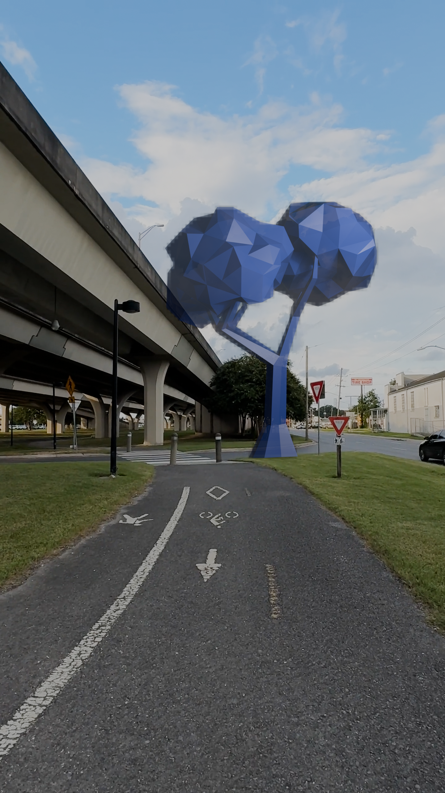


img {
  width: 50%;
  float: left;
  padding-right: 30px;
  padding-bottom: 50px;
  height: 800px;
  object-fit: cover;
}

p:nth-child(1,2,3) {
  width: 40%;
  float: right;
}

video {
  margin-top: 50px;
  width: 80%;
  padding-left: 10%;
}


One of the most interesting parts of some AR heasdsets is the ability to dim sections of the lenses in order to enhance contrast or show dark colours, this is called segmented or pixelated dimming.
However this dimming will never perfectly match the display image, if you hold your finger within a centimetre of your eye you will find the edges are blurry, the same is true if your finger is replaced with an opaque shape on your glasses lens.
AR displays get around this by collimating the light, meaning rays come in parallel, and so the effective focal distance is at infinity. Light from the real world is not collimated, so the blur will always exist.

Eventually I'm sure the resolution of the opaque mask will increase, and algorithms based on inverse lithography will do a lot to align the blurred shadow with the projected image, but I'm not interested in that
I'm more interested in the future retrofuturistic cyberpunk adjacent aesthetic you get without those advanced algorithms.

I see two options.
First, the shadow surrounds the image, the digital world casts a shadow on real life, as if they are some terrible invading entity.
Second, the shadow is slightly smaller than the image, images from the digital world have a shimmering halo, as if their credibility fraying at the edges.
I made some renders of what this could look like, and I think it's such a cool effect.

video::large.mkv[]
First is the most basic version of the effect.
Cells the tree appear in front of are darkened proportionally to the amount the tree overlaps.

video::grow_large.mkv[]
Next I increased the border around the tree, as you can see it looks similar to the base case but worse.

video::shrink_large.mkv[]
Things get more interesting with this next version, the shimmering edges look so cool.

video::smooth.mkv[]
In this version I shrunk the cell size and increased the blur.
I think this one looks the worst.
Without the cool effect there's nothing to distract from my bad tracking, and the uncanny valley effect of the obviously fake tree is worse.
